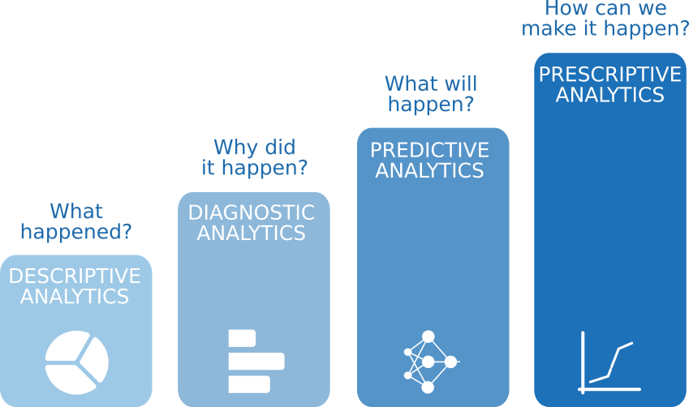

To analyze data, core components of analytics are divided into the following categories:


~~~ html

~~~

## Descriptive Analytics
- `Answer the question`: What happended?
- `Input`: historical data
- `Output`: Visualization

## Diagnostic Analytics
- `Answer the question`: Why did it happen?
- `Input`: historical data
- `Output`: Visualization

